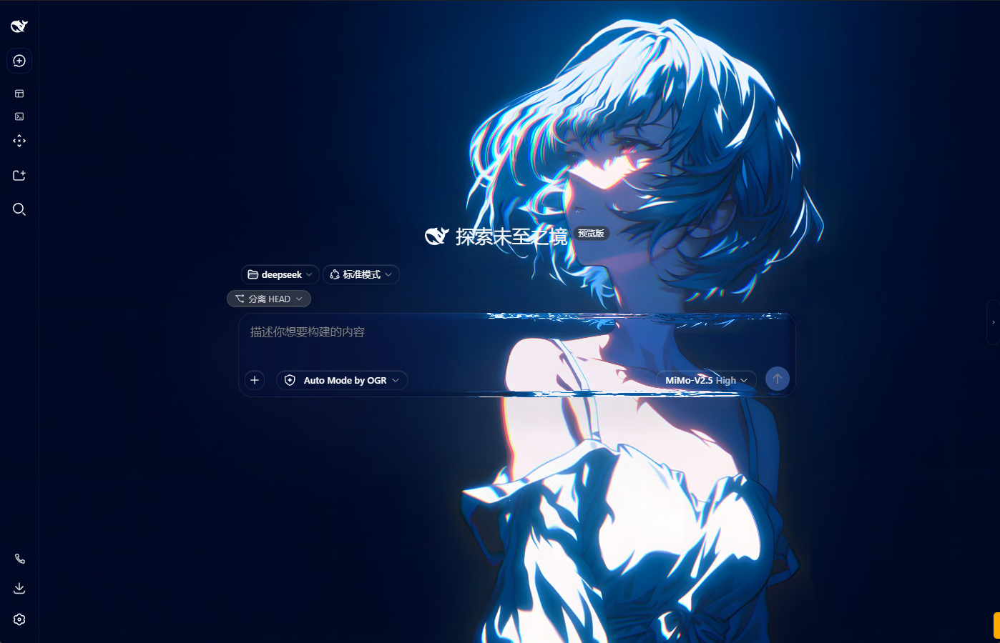
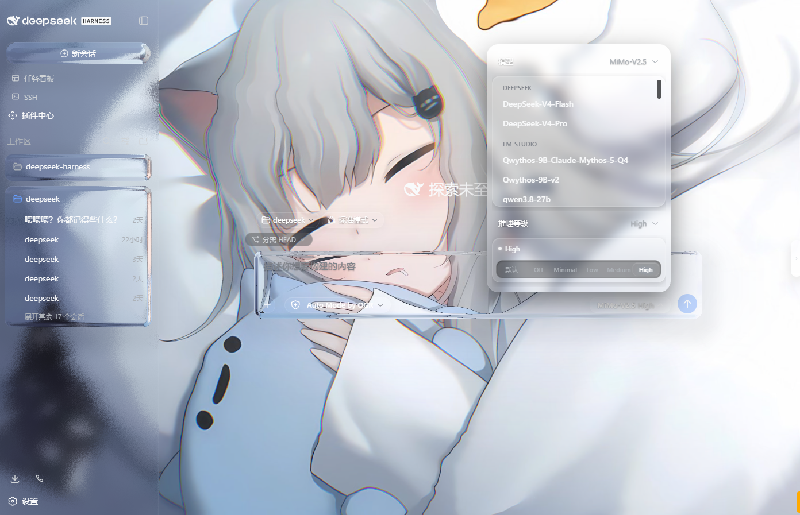
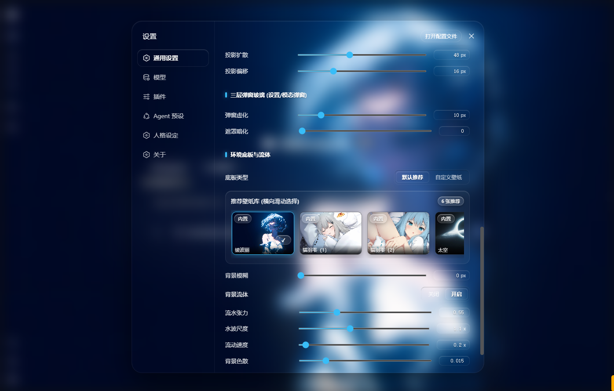

# DeepSeek Harness - 液态玻璃与动态壁纸主题 (Liquid Glass Theme)

DeepSeek Harness 的界面主题插件，提供基于 WebGL 的液态透镜折射、水波交互、分层毛玻璃效果，以及自定义图片/视频壁纸功能。

---

## 版本说明

- **v1.0.0 (`v1.0-web` 分支)**：面向 Web 浏览器环境的配置标签。自定义壁纸保存在浏览器的 IndexedDB 中。
- **v2.0.0 (`main` 分支)**：面向桌面端 `deepseek-harness-desktop` 的配置标签。支持将壁纸保存到本地 `~/.dsh/wallpapers/` 目录，并通过本地 HTTP 206 分片接口加载视频。

### 引用方式

```json
// Web 版
"@deepseek-ai/dsh-client-ui-liquid-glass": "github:Rainpomelo/deepseek-harness-liquid-glass-theme#v1.0.0"

// 桌面端版
"@deepseek-ai/dsh-client-ui-liquid-glass": "github:Rainpomelo/deepseek-harness-liquid-glass-theme#v2.0.0"
```

---

## 效果预览

### 1. 动态壁纸与水波交互演示 (Live Demo)


### 2. 桌面主体效果 (Layer 2 液态透镜折射与动态底板)


### 3. 桌面弹窗效果 (Layer 3 全景虚化与毛玻璃)


### 4. 设置面板与光学参数控制


---

## 插件功能

### 1. 分层渲染
- **背景层 (Layer 0)**：底层 WebGL Canvas 渲染动态壁纸与鼠标点击的水波。
- **侧边栏 (Layer 1)**：侧边栏与详情抽屉等基础容器，提供高斯模糊与暗色底板。
- **输入框与卡片 (Layer 2)**：输入框、会话卡片与操作按钮，在 WebGL Shader 中计算折射、色散、曲率与边缘高光。
- **弹窗与菜单 (Layer 3)**：弹窗打开时底层虚化，弹窗本身使用半透明毛玻璃样式。

### 2. 壁纸支持
- **预设壁纸**：自带 6 款预设壁纸。
- **自定义壁纸**：支持上传图片（PNG / JPG / WebP）与视频（MP4 / WebM / MOV）。
- **存储机制**：前端保存在 IndexedDB；在提供本地后端服务时会存入 `~/.dsh/wallpapers/`。

### 3. 参数调节
在设置面板中可直接调节参数：
- 折射率（IOR）、透镜曲率、色散、倒角厚度、透镜模糊度；
- 弹窗虚化半径（`modalBlur` 0 ~ 60px）、遮罩暗度（`l3MaskOpacity` 0.00 ~ 0.90）；
- 鼠标水波振幅、背景流体流动速度与波纹强度。

---

## 安装与使用

### 方式一：在本地 profiles 中引入（推荐）

1. 将本仓库 clone 到本地，例如 `C:/plugins/deepseek-harness-liquid-glass`。
2. 打开你使用的 profile 配置文件（如 `~/.dsh/profiles/web/package.json`）。
3. 在 `dependencies` 中添加本地文件引用：

```json
{
  "dependencies": {
    "@deepseek-ai/dsh-client-ui-liquid-glass": "file:/path/to/deepseek-harness-liquid-glass"
  },
  "dsh": {
    "profile": {
      "bundles": [
        "@deepseek-ai/dsh-client-ui-liquid-glass"
      ]
    }
  }
}
```

4. 启动 DeepSeek Harness 即可生效：
```bash
dsh --profile web
```

---

### 方式二：直接从 GitHub 引用

在 profile 的 `package.json` 中配置：

```json
{
  "dependencies": {
    "@deepseek-ai/dsh-client-ui-liquid-glass": "github:Rainpomelo/deepseek-harness-liquid-glass-theme"
  }
}
```

---

## 配置与控制

启动 DeepSeek Harness 后：
1. 点击左下角 **「设置」** -> 进入 **「通用设置」**；
2. 找到 **「分级液态玻璃与动态壁纸」** 控制行：
   - **壁纸选择**：可直接在「内置推荐」中滑动挑选，或点击「+ 添加壁纸」上传自定义视频/图片；
   - **Layer 2 (二层悬浮液态透镜)**：调节输入框透镜的折射率、曲率及倒角高光；
   - **Layer 3 (三层弹窗玻璃)**：调节弹窗开启时的背景虚化模糊度与暗化遮罩深度；
   - **保存与读取预设**：可将当前的光学参数组合一键保存至本地。

---

## 核心参数对照表

| 参数名称 | 默认值 | 调节范围 | 说明 |
| :--- | :--- | :--- | :--- |
| **折射率 (IOR)** | `1.30` | `0.80 ~ 2.40` | 斯涅尔光学折射强度 |
| **透镜曲率 (Bulge)** | `1.80` | `-1.50 ~ 2.50` | 凸透镜/凹透镜视差位移倍数 |
| **色散分离 (Dispersion)** | `0.035` | `0.00 ~ 0.10` | 边缘 RGB 彩虹分离度 |
| **倒角宽度 (Bevel)** | `0.015` | `0.005 ~ 0.10` | 透镜边缘切角反光宽度 |
| **高光强度 (Rim Intensity)** | `0.45` | `0.00 ~ 1.00` | 135° 顶光边缘高光反射亮度 |
| **手势水波 (Ripple Amp)** | `0.30` | `0.00 ~ 1.00` | 鼠标点击时的水面涟漪幅度 |
| **弹窗虚化 (Modal Blur)** | `24px` | `0 ~ 60px` | 弹窗打开时底层画面的高斯模糊半径 |
| **遮罩暗化 (Mask Opacity)** | `0.75` | `0.00 ~ 0.90` | 弹窗遮罩层的深色对比度 |

---

## 目录结构

```text
├── src/
│   ├── client/
│   │   ├── glass-shader.ts        # WebGL 物理透镜 Fragment/Vertex Shader 核心引擎
│   │   ├── glass-ambient.ts       # 底层 Canvas 动态环境渲染器
│   │   ├── theme-layer.ts         # 主题 Token 覆盖与 DOM 运行时图层管理
│   │   ├── wallpaper-storage.ts   # IndexedDB 壁纸与视频离线存储
│   │   ├── LiquidGlassControls.tsx# 设置面板阻尼滑动与调节控件
│   │   └── liquid-glass.module.css# 多层光学穿透样式与动画
├── lib/                           # tsdown 构建后的浏览器端 ESM/CJS 产物
├── package.json
└── README.md
```

---

## 开源协议

[MIT License](LICENSE)
