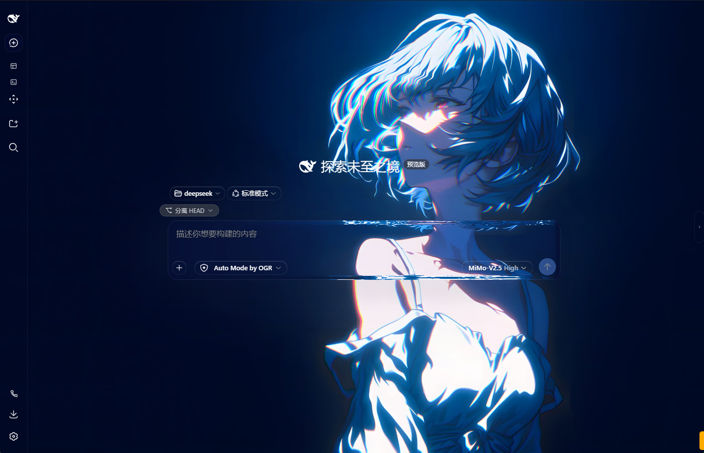
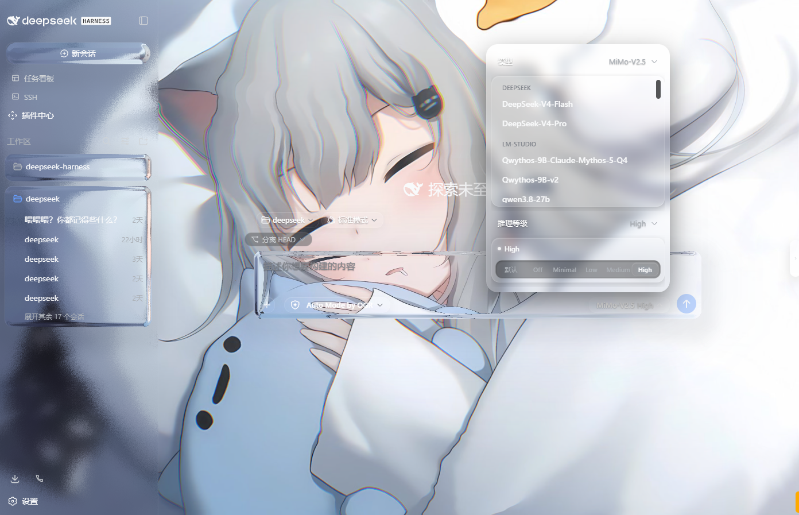
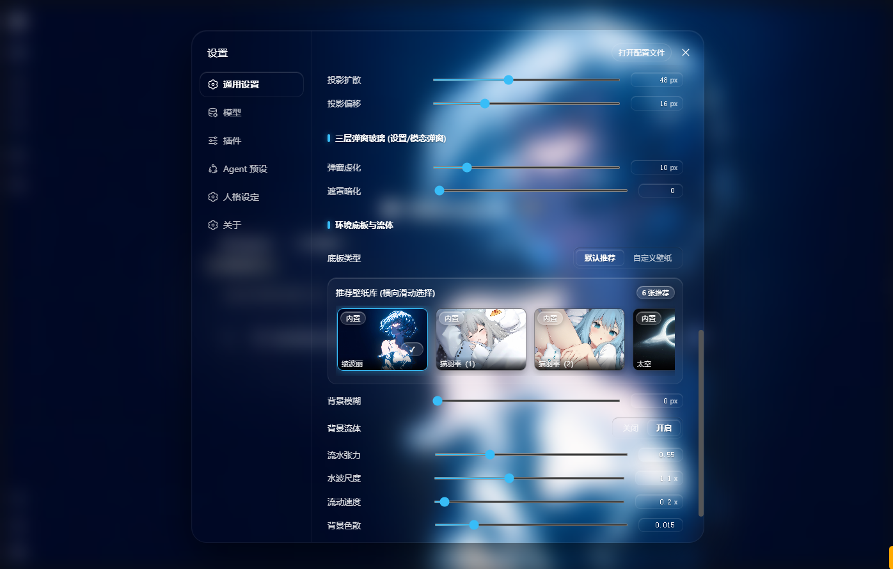

# DeepSeek Harness — 液态玻璃与动态壁纸主题

> Liquid Glass & Live Wallpaper for DeepSeek Harness

基于 WebGL 的液态透镜折射、水波交互、分层毛玻璃，以及自定义图片/视频壁纸。

**一个版本同时支持 DSH Web 与官方桌面版**（当前版本：`v2.0.1`）。

---

## 兼容性

| 宿主 | DSH 版本 | 支持 |
| :--- | :--- | :--- |
| Web（`dsh web`） | 0.1.0-rc.5 ~ 0.1.1-rc.2 | ✅ 通过 `@deepseek-ai/dsh-client-runtime/client` 加载 store 引擎 |
| Web（`dsh web`） | 0.1.2-alpha.2 及以后（含 0.1.7 线） | ✅ 通过 `@deepseek-ai/dsh-client-store` 加载 |
| 官方桌面版 | 0.2.0-rc.2 | ✅ 实机验证 |

打包格式固定到完整 commit / tag，通过 `dsh.client` 声明为 Web 客户端插件，row ID 为 `ui-liquid-glass`。

DSH 在 0.2.0 换代时把 store 引擎从 `@deepseek-ai/dsh-client-runtime` 挪到了 `@deepseek-ai/dsh-client-store`，而且两个包的发布区间**互不重叠**（前者止于 0.1.1-rc.2，后者起于 0.1.2-alpha.2）。本插件在**运行时**解析引擎位置，优先新布局、失败回退旧布局，因此同一份构建可以服务两代宿主，不需要按版本切换安装地址。

---

## 安装

### Web 版

```sh
dsh plugin --profile web add "github:Rainpomelo/dsh-liquid-glass-theme#v2.0.1"
```

装完重启 `dsh web` 即可。

### 官方桌面版

官方桌面版**不要在终端执行 `dsh plugin --profile desktop`**（launcher 会直接拒绝，该 profile 由桌面应用独占管理）。请改用桌面应用内的插件管理器：

1. 打开桌面应用 →「插件」→「添加插件」
2. 输入：

```
github:Rainpomelo/dsh-liquid-glass-theme#v2.0.1
```

3. 启用后重启应用。

### 通过皮肤市场安装

本主题已收录于 [DSH 皮肤市场](https://kingofsoysauce.github.io/dsh-skin-market/)。安装 `dsh-skin-market` 后可在「设置 → 皮肤市场」中一键安装（Web），无需手输上面的命令。

### 手动引用（开发调试）

把仓库 clone 到本地，然后在 profile 的 `package.json` 中引用：

```json
{
  "dependencies": {
    "@deepseek-ai/dsh-client-ui-liquid-glass": "file:C:/path/to/dsh-liquid-glass-theme"
  },
  "dsh": {
    "profile": {
      "bundles": [
        "@deepseek-ai/dsh-client-ui-liquid-glass"
      ]
    }
  }
}
```

也可以直接用 GitHub 引用：

```json
"@deepseek-ai/dsh-client-ui-liquid-glass": "github:Rainpomelo/dsh-liquid-glass-theme#v2.0.1"
```

---

## 效果预览

### 动态壁纸与水波交互


（更高画质：[MP4 版](docs/images/live_wallpaper_demo.mp4)）

### 桌面主体 — 二层液态透镜折射与动态底板



### 弹窗 — 三层全景虚化与毛玻璃



### 设置面板与光学参数



---

## 功能

### 1. 分层渲染

| 层 | 覆盖范围 | 效果 |
| :--- | :--- | :--- |
| **Layer 0** 环境底板 | 整页底层 | WebGL Canvas 渲染动态壁纸与鼠标点击水波，另有流体折射流动 |
| **Layer 1** 基底玻璃 | 侧边栏、面板、卡片 | 高斯模糊、暗化、边缘光泽 |
| **Layer 2** 液态透镜 | 悬浮输入框、焦点组件、气泡卡片 | Shader 实时计算斯涅尔折射、色散、曲率与倒角高光 |
| **Layer 3** 弹窗玻璃 | 设置页与模态弹窗 | 弹窗打开时底层虚化，弹窗本体半透明毛玻璃 |

### 2. 壁纸

- **9 款内置壁纸**：3 款动态视频（DeepSeek / ELDEN RING / 雷暴预感 1080p）+ 6 款静态原画（绫波丽 / 猫羽雫 1 / 猫羽雫 2 / 太空星轨 / 夏日 / 水洼倒影），已以 Base64 形式内嵌，**零网络依赖、离线可用**
- **自定义壁纸**：支持图片（PNG / JPG / WebP）与视频（MP4 / WebM / MOV）
- **存储**：Web 端存于浏览器 IndexedDB；宿主提供本地服务时写入 `~/.dsh/wallpapers/`，视频经本地 HTTP 206 分片接口流式加载

### 3. 参数调节

在「设置 → 通用设置 → **分级液态玻璃与动态壁纸**」中实时调节，并可一键保存/读取预设。

---

## 参数与默认值

默认值取自源码（`LIQUID_GLASS_DEFAULTS`），范围取自设置界面控件定义。

### 一层基底玻璃（侧边栏 / 面板）

| 参数 | 默认值 | 范围 |
| :--- | :--- | :--- |
| 基底模糊 `l1Blur` | `2` | `0 ~ 60` |
| 基底暗化 `l1Opacity` | `0.1` | `0.00 ~ 0.90` |
| 边缘光泽 `l1Border` | `0.1` | `0.00 ~ 1.00` |

### 二层液态透镜（悬浮输入框 / 组件）

| 参数 | 默认值 | 范围 |
| :--- | :--- | :--- |
| 折射率 `ior` | `1.3` | `0.80 ~ 2.40` |
| 透镜曲率 `bulge` | `0.25` | `-1.50 ~ 2.50` |
| 色散分离 `dispersion` | `0` | `0.00 ~ 0.10` |
| 倒角厚度 `bevel` | `0.01` | `0.005 ~ 0.10` |
| 透镜模糊 `lensBlur` | `0` | `0 ~ 40` |
| 暗化 `darkening` | `0` | `0.00 ~ 0.80` |
| 高光强度 `rimIntensity` | `0` | `0.00 ~ 1.00` |
| 光源方位 `lightAngle` | `105` | `0 ~ 360` |
| 色彩鲜艳度 `vibrancy` | `1.2` | `0.50 ~ 2.00` |
| 水波张力 `rippleAmp` | `0.5` | `0.00 ~ 1.00` |
| 投影不透明度 `dropShadowOpacity` | `0` | `0.00 ~ 1.00` |
| 投影模糊 `dropShadowBlur` | `48` | `0 ~ 120` |
| 投影偏移 `dropShadowY` | `16` | `0 ~ 60` |

### 三层弹窗玻璃（设置 / 模态弹窗）

| 参数 | 默认值 | 范围 |
| :--- | :--- | :--- |
| 弹窗虚化 `modalBlur` | `5` | `0 ~ 60` |
| 遮罩暗化 `l3MaskOpacity` | `0.15` | `0.00 ~ 0.90` |

### 环境底板与流体（Layer 0）

| 参数 | 默认值 | 说明 |
| :--- | :--- | :--- |
| 背景模式 `background` | `wallpaper` | `gradient` 纯色渐变 / `wallpaper` 壁纸 |
| 背景模糊 `bgBlur` | `0` | 底板整体模糊 |
| 流体折射 `bgLiquidEnabled` | `true` | 底层流体折射开关 |
| 流体振幅 `bgLiquidAmp` | `0.55` | — |
| 流体尺度 `bgLiquidScale` | `0.4` | — |
| 流动速度 `bgLiquidSpeed` | `0.1` | — |
| 流体色散 `bgLiquidDispersion` | `0.025` | — |

---

## 安装包体积

安装包约 **150 MB**，其中绝大部分是 3 段内置高清动态壁纸（1080p，合计约 126 MB），随包分发以便开箱即用、完全离线。另有约 19 MB 的客户端 bundle，内含 9 款内置壁纸的 Base64 数据。

如果不需要内置动态壁纸，可以在安装后从 `~/.dsh/wallpapers/` 删除对应的 `default_*.mp4`。

---

## 目录结构

```text
├── src/
│   ├── index.ts                     # 宿主插件：默认壁纸落盘、/api/liquid-glass/* 路由
│   └── client/
│       ├── index.ts                 # 客户端入口：主题注入、壁纸引擎、图层管理
│       ├── glass-shader.ts          # WebGL 物理透镜 Shader（折射/色散/曲率/高光）
│       ├── glass-ambient.ts         # 底层动态环境渲染
│       ├── theme-layer.ts           # 主题 Token 覆盖与 DOM 图层
│       ├── settings-store.ts        # 设置状态存储 + 默认参数（跨 DSH 世代解析 store 引擎）
│       ├── wallpaper-storage.ts     # 壁纸与视频存储（IndexedDB / 本地文件）
│       ├── builtin-wallpapers.ts    # 9 款内置壁纸（Base64 内嵌）
│       ├── LiquidGlassAppearanceRow.tsx   # 设置面板控件
│       ├── LiquidGlassPluginCard.tsx      # 插件列表卡片
│       ├── AccordionModelSelect.tsx       # 模型选择器玻璃化
│       ├── locales.ts               # 中英文案
│       └── *.module.css             # 多层光学样式
├── lib/                             # esbuild 构建产物（client.js / index.js）
├── assets/                          # 内置动态壁纸源文件
├── docs/images/                     # README 截图
├── tests/                           # node:test 用例
├── build.mjs                        # 构建脚本
└── package.json
```

---

## 开发

```sh
npm install
node build.mjs                 # 构建（esbuild）
node --test tests/*.test.mjs   # 测试
```

推送到 `main` 或开 PR 时，GitHub Actions 会自动跑构建、测试，并检查安装包里仍然带有 `cordis.patch.yml`。

> **关于类型**：`build.mjs` 只做打包（esbuild），**不做类型检查**；本包也**不发布类型声明**。
> 历史上 `lib/types/**` 曾随包发布，但它在 2026-08-21 之后再没更新过，且内容有误（宿主侧只声明了 `apply(): void`），已删除。`src/` 是全量 TypeScript 源码，需要类型信息请直接阅读源码，或自行安装 TypeScript 后运行 `tsc --noEmit`。

---

## 常见问题

**装完主题没有生效？**
确认插件已在该 profile 的 `dsh.profile.bundles` 中，且重启了宿主。若仍无效，检查宿主版本是否在下方兼容区间内。

**安装后报 `bundle patch is missing: ./cordis.patch.yml`？**
这是 v2.0.1 之前版本的打包缺陷（`files` 白名单漏掉了 `cordis.patch.yml`）。升级到 `#v2.0.1` 即可。

**为什么官方桌面版不能一键安装？**
桌面 profile 由桌面应用独占管理，命令行无法操作；请使用应用内的「插件 → 添加插件」。

**主题与其它皮肤插件冲突？**
同一时间只启用一个皮肤插件。若页面被皮肤搞到无法操作，先关闭 DSH 进程，再运行皮肤市场提供的 `dsh-skin-market-reset` 恢复默认外观。

---

## 开源协议

[MIT License](LICENSE)
